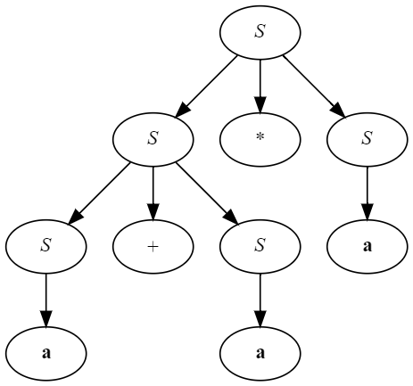

**Упражнение 2.2.1.** Рассмотрим контекстно-свободную грамматику

```EBNF
S → S S + | S S * | a
```
```
а) Покажите, как данная грамматика генерирует строку aa+a*.
б) Постройте дерево разбора для данной строки.
в) Какой язык генерирует данная грамматика? Обоснуйте свой ответ.
```

---

*Задание А*
```
1) а - S в соотвествии с продукцией 3;
2) а - S в соотвествии с продукцией 3;
3) аа+ - S в соотвествии с продукцией 1;
4) а - S в соотвествии с продукцией 3;
5) аа+а* - S в соотвествии с продукцией 2.
```

*Задание Б*



*Задание В*

Данная грамматика генерирует язык постфиксной записи, 
так как оператор следует после обоих подвыражений каждого выражения.